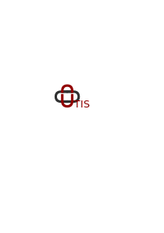
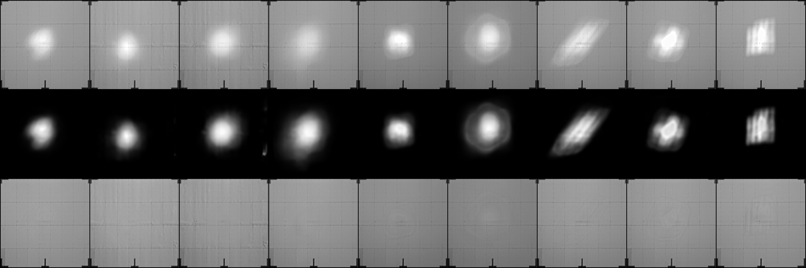

<p align="center">

</p>

[](https://doi.org/10.1016/j.solener.2024.112811)
[](https://opensource.org/licenses/MIT)
[](https://fair-software.eu)


# UTIS-HeliostatBeamCharacterization
UNet-Based Target Image Segmentation for Camera Target Method in Solar Tower Plants

## Overview

This project presents a robust implementation of the UNet3+ framework designed for background separation and flux determination in calibration target images used in solar tower plants. The model is trained using artificially generated target images, which are created by combining background images with simulated focal spots. By leveraging these synthetic images with known properties, the UNet model is trained to accurately separate the background from the focal spots, enabling precise flux prediction. For an in-depth explanation and methodology, please refer to [this paper](https://doi.org/10.1016/j.solener.2024.112811). The model used to achieve the results in this paper is placed in the [train models](https://github.com/DLR-SF/UTIS-HeliostatBeamCharacterization/tree/main/trained_models) folder.

## Directory Structure

```
UTIS-HeliostatBeamCharacterization/
│
├── data/  # Directory containing image datasets used for training and inference
│   ├── emptyTargetImages/  # Images of empty targets used for artificial data generation
│   ├── fluxImages/  # Images representing flux used for artificial data generation
│   └── realSamples/  # Real images used to test the model's inference capabilities
│
├── logs/  # Directory to store training logs
├── trained_models/  # Directory to store trained model checkpoints
├── tests/  # Directory for test scripts and inference
│   ├── predict.py  # Script for running inference with a trained model
│   └── results.png  # Example output from the inference script
│
├── utis/  # Core package directory containing model and utility code
│   ├── __init__.py  # Makes this directory a Python package
│   ├── dataset.py  # Script for loading and processing image data
│   ├── architecture/
│   │   ├── __init__.py
│   │   ├── UNet_3Plus_.py  # UNet3+ model architecture
│   │   └── layers.py  # Additional layers used in the model
│   ├── unet_pl_module.py  # PyTorch Lightning module for UNet3+
│   └── train.py  # Script for training the UNet3+ model
│
├── setup.py  # Script for installing the package
├── README.md  # Project description
└── LICENSE  # License for your package
```

## Usage

### Training

Run the training script:

```sh
python -m utis.train
```

### Inference

Run the inference script:

```sh
python -m tests.predict
```

## Results

The predicted images and a sample result grid are saved in the specified output directory as `results.png`:

<div align="center">
  
</div>

The result grid is organized as follows:
- **First row:** Input image
- **Second row:** Predicted focal spot
- **Third row:** Predicted background

## Acknowledgments
This work is supported by the [Helmholtz AI](https://www.helmholtz.ai/) platform grant.

-----------
<div align="center">
  <a href="https://www.dlr.de/EN/Home/home_node.html"></a>
  <a href="https://www.fz-juelich.de/portal/EN/Home/home_node.html"></a>
  <a href="https://www.helmholtz.ai/"></a>
</div>
